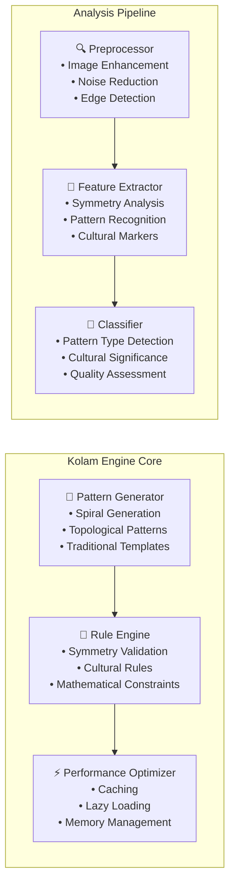
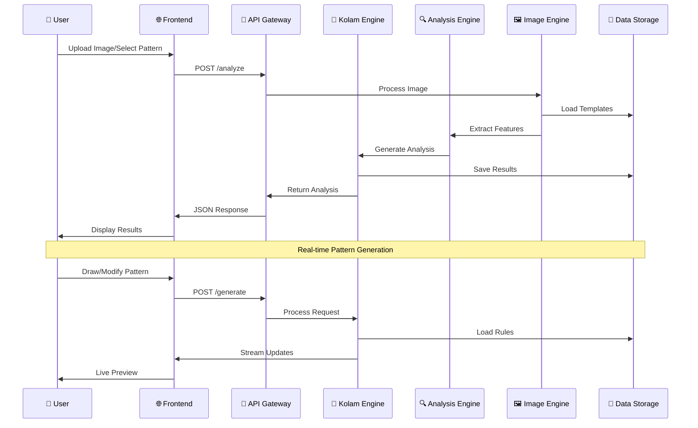

# Kolam Art System Architecture - Modern Design

## System Overview

```mermaid
graph TB
    %% User Layer
    subgraph "👤 User Interface Layer"
        direction TB
        WebUI["🌐 Web Application<br/>React 18.2.0"]
        MobileUI["📱 Mobile Interface<br/>Responsive Design"]
        DesktopUI["🖥️ Desktop Interface<br/>Tkinter GUI"]
    end

    %% Frontend Services
    subgraph "⚛️ Frontend Services"
        direction TB
        Router["🧭 React Router<br/>Navigation"]
        State["🗃️ State Management<br/>Context API"]
        Canvas["🎨 Interactive Canvas<br/>Fabric.js"]
        Components["🧩 UI Components<br/>Styled Components"]
        Utils["🔧 Utilities<br/>File Saver, HTML2Canvas"]
    end

    %% API Gateway
    subgraph "🌐 API Gateway Layer"
        direction TB
        Gateway["🚪 API Gateway<br/>Flask + CORS"]
        Auth["🔐 Authentication<br/>Session Management"]
        RateLimit["⏱️ Rate Limiting<br/>Request Throttling"]
    end

    %% Core Services
    subgraph "⚙️ Core Services"
        direction TB
        KolamEngine["🎯 Kolam Engine<br/>Pattern Generation"]
        AnalysisEngine["🔍 Analysis Engine<br/>Pattern Recognition"]
        ImageEngine["🖼️ Image Engine<br/>Processing & Analysis"]
        CulturalEngine["🏛️ Cultural Engine<br/>Traditional Analysis"]
    end

    %% Processing Layer
    subgraph "🧮 Processing Layer"
        direction TB
        MathLib["📊 Mathematical Libraries<br/>NumPy, SciPy"]
        VisionLib["👁️ Computer Vision<br/>OpenCV, PIL"]
        GraphLib["🕸️ Graph Algorithms<br/>NetworkX"]
        MLlib["🤖 Machine Learning<br/>Scikit-Image"]
    end

    %% Graphics Layer
    subgraph "🎨 Graphics & Rendering"
        direction TB
        Turtle["🐢 Turtle Graphics<br/>Traditional Drawing"]
        Matplotlib["📈 Matplotlib<br/>Scientific Visualization"]
        CanvasAPI["🖼️ HTML5 Canvas<br/>Web Graphics"]
        Vector["📐 Vector Graphics<br/>SVG Generation"]
    end

    %% Data Layer
    subgraph "💾 Data Layer"
        direction TB
        FileSystem["📁 File System<br/>JSON, Images, SVG"]
        Cache["⚡ Cache Layer<br/>In-Memory Storage"]
        Config["⚙️ Configuration<br/>Settings & Templates"]
    end

    %% External Services
    subgraph "🌍 External Services"
        direction TB
        CDN["🌐 Content Delivery<br/>Static Assets"]
        Fonts["🔤 Google Fonts<br/>Typography"]
        Analytics["📊 Analytics<br/>Usage Tracking"]
    end

    %% User Interactions
    WebUI --> Router
    MobileUI --> Router
    DesktopUI --> Turtle

    %% Frontend Flow
    Router --> State
    State --> Canvas
    State --> Components
    Components --> Utils

    %% API Flow
    Canvas --> Gateway
    Gateway --> Auth
    Auth --> RateLimit
    RateLimit --> KolamEngine

    %% Service Distribution
    KolamEngine --> AnalysisEngine
    KolamEngine --> ImageEngine
    KolamEngine --> CulturalEngine

    %% Processing Dependencies
    AnalysisEngine --> MathLib
    AnalysisEngine --> GraphLib
    ImageEngine --> VisionLib
    ImageEngine --> MLlib
    CulturalEngine --> MathLib

    %% Graphics Dependencies
    KolamEngine --> Turtle
    KolamEngine --> Matplotlib
    Canvas --> CanvasAPI
    AnalysisEngine --> Vector

    %% Data Flow
    KolamEngine --> FileSystem
    AnalysisEngine --> Cache
    ImageEngine --> FileSystem
    CulturalEngine --> Config

    %% External Dependencies
    Components --> CDN
    Components --> Fonts
    Gateway --> Analytics

    %% Styling
    classDef userLayer fill:#e3f2fd,stroke:#1976d2,stroke-width:2px
    classDef frontendLayer fill:#f3e5f5,stroke:#7b1fa2,stroke-width:2px
    classDef apiLayer fill:#e8f5e8,stroke:#388e3c,stroke-width:2px
    classDef coreLayer fill:#fff3e0,stroke:#f57c00,stroke-width:2px
    classDef processLayer fill:#fce4ec,stroke:#c2185b,stroke-width:2px
    classDef graphicsLayer fill:#f1f8e9,stroke:#689f38,stroke-width:2px
    classDef dataLayer fill:#e0f2f1,stroke:#00796b,stroke-width:2px
    classDef externalLayer fill:#f9fbe7,stroke:#827717,stroke-width:2px

    class WebUI,MobileUI,DesktopUI userLayer
    class Router,State,Canvas,Components,Utils frontendLayer
    class Gateway,Auth,RateLimit apiLayer
    class KolamEngine,AnalysisEngine,ImageEngine,CulturalEngine coreLayer
    class MathLib,VisionLib,GraphLib,MLlib processLayer
    class Turtle,Matplotlib,CanvasAPI,Vector graphicsLayer
    class FileSystem,Cache,Config dataLayer
    class CDN,Fonts,Analytics externalLayer
```

## System Architecture Components

### 🎯 Core Services Architecture

### 🔄 Data Flow Architecture

## Technology Stack

### Frontend Technologies
- **React 18.2.0** - Modern UI framework with hooks and concurrent features
- **Fabric.js** - Interactive canvas for pattern drawing and manipulation
- **Styled Components** - CSS-in-JS for component styling
- **React Router** - Client-side navigation and routing
- **React Color** - Advanced color picker components
- **HTML2Canvas** - Screenshot and export functionality

### Backend Technologies
- **Flask 2.3.3** - Lightweight Python web framework
- **Flask-CORS** - Cross-origin resource sharing
- **NumPy** - Numerical computing and array operations
- **OpenCV** - Computer vision and image processing
- **NetworkX** - Graph algorithms and network analysis
- **SciPy** - Scientific computing and optimization

### Graphics & Visualization
- **Python Turtle** - Traditional drawing and pattern generation
- **Matplotlib** - Scientific visualization and plotting
- **Pillow (PIL)** - Image processing and manipulation
- **Scikit-Image** - Advanced image processing algorithms

### Data Storage
- **JSON** - Configuration and data exchange format
- **PNG/JPEG** - Raster image storage
- **SVG** - Vector graphics for scalable patterns
- **File System** - Local storage for assets and cache

## Key Features

### 🎨 Pattern Generation
- **Spiral Kolam Generation** - Mathematical spiral patterns
- **Topological Patterns** - Complex geometric designs
- **Traditional Templates** - Culturally authentic patterns
- **Real-time Preview** - Live pattern generation and editing

### 🔍 Analysis Capabilities
- **Symmetry Analysis** - Mathematical symmetry detection
- **Cultural Significance** - Traditional meaning analysis
- **Pattern Recognition** - AI-powered pattern classification
- **Quality Assessment** - Automated pattern evaluation

### 🖼️ Image Processing
- **Upload & Analysis** - Process existing kolam images
- **Pattern Extraction** - Convert images to editable patterns
- **Enhancement** - Improve image quality and clarity
- **Export Options** - Multiple format support

### 🌐 Web Interface
- **Responsive Design** - Mobile-first approach
- **Interactive Canvas** - Touch and mouse support
- **Real-time Collaboration** - Multi-user editing
- **Professional UI** - Material Design 3.0 inspired

## Performance Optimizations

### Frontend Optimizations
- **Code Splitting** - Lazy loading of components
- **Memoization** - React.memo for expensive components
- **Virtual Scrolling** - Efficient large list rendering
- **Image Optimization** - WebP format and compression

### Backend Optimizations
- **Caching Strategy** - Redis for frequently accessed data
- **Database Indexing** - Optimized query performance
- **Async Processing** - Background task processing
- **Memory Management** - Efficient resource utilization

### API Optimizations
- **Rate Limiting** - Prevent abuse and ensure stability
- **Response Compression** - Gzip compression for large responses
- **CDN Integration** - Global content delivery
- **Monitoring** - Real-time performance tracking

## Security Features

### Authentication & Authorization
- **Session Management** - Secure user sessions
- **Role-based Access** - Different permission levels
- **API Key Management** - Secure API access
- **Input Validation** - Prevent injection attacks

### Data Protection
- **Encryption** - Data encryption at rest and in transit
- **Sanitization** - Input sanitization and validation
- **CORS Configuration** - Secure cross-origin requests
- **Rate Limiting** - Prevent DDoS attacks

## Deployment Architecture

### Development Environment
- **Local Development** - Flask development server
- **Hot Reloading** - Automatic code reloading
- **Debug Mode** - Detailed error reporting
- **Testing Suite** - Automated testing framework

### Production Environment
- **Containerization** - Docker containers
- **Load Balancing** - Multiple server instances
- **Auto-scaling** - Dynamic resource allocation
- **Monitoring** - Real-time system monitoring

## Future Enhancements

### Planned Features
- **AI Integration** - Advanced machine learning models
- **3D Visualization** - Three-dimensional pattern rendering
- **AR/VR Support** - Augmented reality kolam creation
- **Mobile App** - Native mobile applications

### Scalability Improvements
- **Microservices** - Service-oriented architecture
- **Cloud Integration** - AWS/Azure deployment
- **Global CDN** - Worldwide content delivery
- **Real-time Sync** - Live collaboration features

