# Kolam Art System Architecture

## System Architecture Diagram

```mermaid
graph TB
    %% User Interface Layer
    subgraph "Frontend Layer (React Ecosystem)"
        UI[React 18.2.0 App]
        Router[React Router DOM]
        Styled[Styled Components]
        Canvas[Fabric.js Canvas]
        Color[React Color Picker]
        Icons[React Icons]
        Toast[React Toastify]
        HTML2C[HTML2Canvas]
        FileS[File Saver]
    end

    %% API Gateway Layer
    subgraph "API Layer"
        CORS[Flask-CORS]
        API[Flask REST API]
    end

    %% Backend Services Layer
    subgraph "Backend Services (Python)"
        MainAPI[Main Flask App]
        KolamAnalyzer[Kolam Analyzer]
        PatternGen[Pattern Generator]
        ImageProc[Image Processor]
        CulturalAnalysis[Cultural Significance Analyzer]
        TopologicalAnalysis[Topological Analysis]
    end

    %% Data Processing Layer
    subgraph "Data Processing & ML"
        NumPy[NumPy - Numerical Computing]
        Matplotlib[Matplotlib - Visualization]
        SciPy[SciPy - Scientific Computing]
        OpenCV[OpenCV - Computer Vision]
        PIL[Pillow - Image Processing]
        NetworkX[NetworkX - Graph Algorithms]
        ScikitImage[Scikit-Image]
    end

    %% Graphics & Drawing Layer
    subgraph "Graphics & Drawing"
        Turtle[Python Turtle Graphics]
        Tkinter[Tkinter GUI]
        MatplotlibPatches[Matplotlib Patches]
        CanvasAPI[HTML5 Canvas API]
    end

    %% Data Storage Layer
    subgraph "Data Storage"
        JSON[JSON Files]
        Images[PNG/JPEG Images]
        SVG[SVG Vector Graphics]
        StaticFiles[Static Assets]
    end

    %% External Services
    subgraph "External Services"
        GoogleFonts[Google Fonts]
        CDN[CDN Resources]
    end

    %% User Interactions
    User[User] --> UI
    User --> Canvas
    User --> Color

    %% Frontend Internal Connections
    UI --> Router
    UI --> Styled
    UI --> Canvas
    UI --> Color
    UI --> Icons
    UI --> Toast
    Canvas --> HTML2C
    Canvas --> FileS

    %% Frontend to Backend
    UI --> CORS
    CORS --> API
    API --> MainAPI

    %% Backend Service Connections
    MainAPI --> KolamAnalyzer
    MainAPI --> PatternGen
    MainAPI --> ImageProc
    MainAPI --> CulturalAnalysis
    MainAPI --> TopologicalAnalysis

    %% Data Processing Connections
    KolamAnalyzer --> NumPy
    KolamAnalyzer --> Matplotlib
    PatternGen --> SciPy
    ImageProc --> OpenCV
    ImageProc --> PIL
    CulturalAnalysis --> NetworkX
    TopologicalAnalysis --> ScikitImage

    %% Graphics Layer Connections
    PatternGen --> Turtle
    PatternGen --> Tkinter
    Matplotlib --> MatplotlibPatches
    Canvas --> CanvasAPI

    %% Data Storage Connections
    MainAPI --> JSON
    ImageProc --> Images
    PatternGen --> SVG
    UI --> StaticFiles

    %% External Service Connections
    UI --> GoogleFonts
    UI --> CDN

    %% Styling
    classDef frontend fill:#e1f5fe
    classDef backend fill:#f3e5f5
    classDef data fill:#e8f5e8
    classDef graphics fill:#fff3e0
    classDef storage fill:#fce4ec
    classDef external fill:#f1f8e9

    class UI,Router,Styled,Canvas,Color,Icons,Toast,HTML2C,FileS frontend
    class MainAPI,KolamAnalyzer,PatternGen,ImageProc,CulturalAnalysis,TopologicalAnalysis,CORS,API backend
    class NumPy,Matplotlib,SciPy,OpenCV,PIL,NetworkX,ScikitImage data
    class Turtle,Tkinter,MatplotlibPatches,CanvasAPI graphics
    class JSON,Images,SVG,StaticFiles storage
    class GoogleFonts,CDN external
```

## Component Details

### Frontend Layer
- **React 18.2.0**: Main UI framework
- **React Router**: Client-side navigation
- **Styled Components**: CSS-in-JS styling
- **Fabric.js**: Interactive canvas for drawing
- **React Color**: Color selection interface
- **React Icons**: Icon library
- **React Toastify**: User notifications
- **HTML2Canvas**: Screenshot functionality
- **File Saver**: File download capabilities

### Backend Services
- **Flask 2.3.3**: Web framework
- **Flask-CORS**: Cross-origin requests
- **Kolam Analyzer**: Pattern analysis engine
- **Pattern Generator**: Kolam creation algorithms
- **Image Processor**: Image manipulation
- **Cultural Analysis**: Traditional significance analysis
- **Topological Analysis**: Mathematical pattern analysis

### Data Processing
- **NumPy**: Numerical computations
- **Matplotlib**: Data visualization
- **SciPy**: Scientific computing
- **OpenCV**: Computer vision
- **Pillow**: Image processing
- **NetworkX**: Graph algorithms
- **Scikit-Image**: Advanced image processing

### Graphics & Drawing
- **Python Turtle**: Traditional drawing
- **Tkinter**: GUI components
- **Matplotlib Patches**: Geometric shapes
- **HTML5 Canvas**: Web graphics

### Data Storage
- **JSON**: Configuration and data exchange
- **PNG/JPEG**: Image files
- **SVG**: Vector graphics
- **Static Files**: Web assets

## Data Flow

1. **User Input** → React UI Components
2. **UI Events** → Fabric.js Canvas
3. **Canvas Data** → Flask API via Axios
4. **API Processing** → Python Backend Services
5. **Data Analysis** → NumPy/SciPy/OpenCV
6. **Pattern Generation** → Turtle Graphics/Matplotlib
7. **Results** → JSON Response
8. **Visualization** → React Components
9. **Export** → HTML2Canvas/File Saver

## Key Features

- **Real-time Pattern Generation**: Interactive canvas with live updates
- **Cultural Analysis**: Traditional significance evaluation
- **Mathematical Analysis**: Topological and symmetry analysis
- **Image Processing**: Upload and analysis of existing patterns
- **Export Capabilities**: Multiple format support
- **Responsive Design**: Mobile-first approach
- **Professional UI**: Material Design 3.0 inspired

